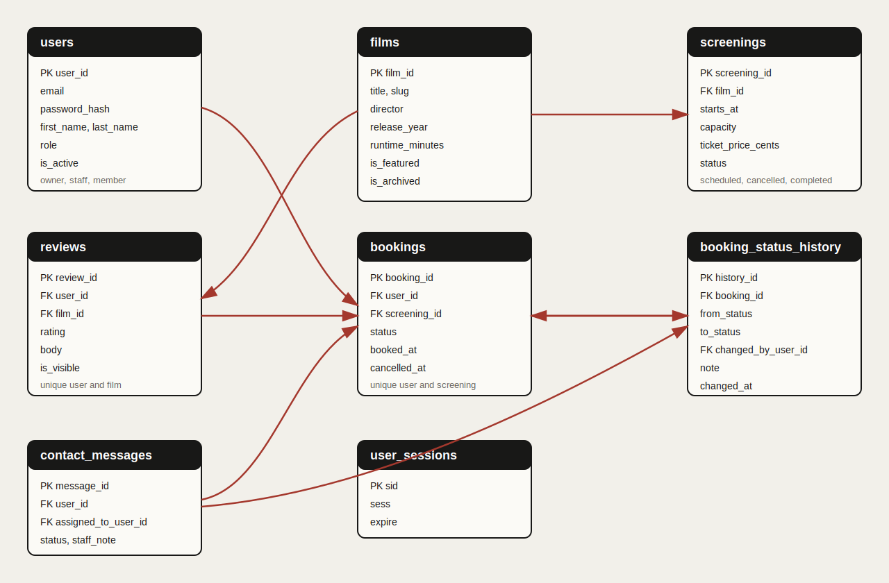

# Independent Cinema Platform

A server-rendered cinema operations platform for a single-screen independent theater. Public visitors can browse films, check screenings, plan a visit, and send contact messages. Members can book screenings, track booking status history, and manage their own reviews. Staff and Owners use protected dashboards for check-in, booking status changes, review moderation, contact message processing, and cinema management.

Live deployment:

```text
https://cse340-independent-cinema.onrender.com
```

## Project Scope

The project is designed for the CSE 340 final project requirements. It demonstrates PostgreSQL relationships, session authentication, role-based authorization, server-side rendering, dynamic content management, user-generated content, and a multi-stage booking workflow.

The core workflow is booking status management:

1. A Member books an upcoming screening.
2. The booking starts as `confirmed`.
3. Staff or Owner can move the booking through valid operational statuses.
4. Each status change writes an append-only history row.
5. The Member can view the current status and status timeline.
6. Completed bookings make the related film available for Member review.

Out of scope: payment, seat selection, multiple auditoriums, external movie APIs, external booking APIs, recommendations, and social login.

## Technology

- Node.js with Express 5
- EJS server-side rendering
- ESM modules
- PostgreSQL
- `express-session` with a PostgreSQL session table
- bcrypt password hashing
- Render deployment

## Database Schema

The database uses normalized tables for users, films, screenings, bookings, booking status history, reviews, contact messages, and PostgreSQL-backed sessions.



Important relationships:

- A booking belongs to one Member and one screening.
- A Member can have only one booking per screening.
- Booking status history belongs to a booking and is append-only.
- A review belongs to one Member and one film.
- A review is allowed only after the Member has a completed booking for that film.
- Contact messages can be public or tied to a signed-in user.
- Operational records are preserved through archive, cancellation, hidden, or inactive states instead of casual deletion.

## Roles and Test Accounts

All test accounts use the same course-provided shared test password. The password is not repeated here so the README can stay safe for public review.

| Role | Email | Main access |
| --- | --- | --- |
| Owner | `owner@cinema.test` | Film management, screening management, user management, Staff operations |
| Staff | `staff@cinema.test` | Booking status operations, review moderation, contact message processing |
| Member | `member@cinema.test` | Booking history, booking detail, cancellation when eligible, own reviews |

## Main Routes

| Area | Routes |
| --- | --- |
| Public | `/`, `/films`, `/films/:filmSlug`, `/screenings`, `/screenings/:screeningId`, `/visit` |
| Authentication | `/login`, `/signup`, `/logout` |
| Member | `/account`, `/account/bookings/:bookingId`, `/account/reviews/new`, `/account/reviews/:reviewId`, `/account/reviews/:reviewId/edit` |
| Staff | `/staff` |
| Owner | `/admin`, `/admin/films`, `/admin/films/new`, `/admin/films/:filmId/edit`, `/admin/screenings`, `/admin/screenings/new`, `/admin/screenings/:screeningId/edit`, `/admin/users` |

## Local Setup

```bash
cd app
pnpm install
cp .env.example .env
```

Set `DATABASE_URL` and `SESSION_SECRET` in `app/.env`, then initialize the database from the repository root:

```bash
psql "$DATABASE_URL" -f database/schema.sql
psql "$DATABASE_URL" -f database/seed.sql
cd app
pnpm db:migrate
psql "$DATABASE_URL" -f ../database/verify.sql
pnpm dev
```

Default local URL:

```text
http://localhost:3400
```

## Verification

Run the automated test suite:

```bash
cd app
pnpm test
```

Useful database checks:

```bash
cd app
pnpm db:migrate
psql "$DATABASE_URL" -f ../database/verify.sql
```

GitHub Actions runs the PostgreSQL schema, seed, migrations, verification queries, automated tests, and tracked-file checks on push.

## Known Limitations

- The seed screening dates can age out, which may limit production verification of future-screening booking actions until the schedule is refreshed.
- The deployment uses Render free services, so the first request after inactivity may be delayed.
- The visual direction is Phase A submission-ready. Portfolio-level branding, original poster assets, motion, and user research synthesis are future improvements.
- Payment, seat selection, multiple auditoriums, external APIs, recommendations, and social login are intentionally excluded from scope.
