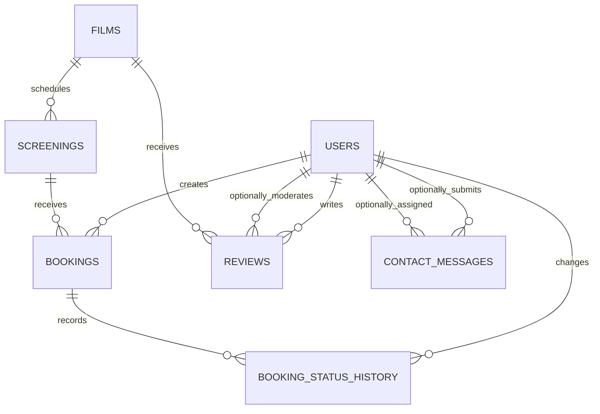

# Step 2: Database Design

## 설계 목표

영화 탐색, 상영 일정, 예약 workflow, review, contact message 운영을 최소한의 명확한 테이블로 표현한다.

설계 원칙:

- 각 테이블은 하나의 책임을 가진다.
- 현재 상태와 상태 변경 history를 분리한다.
- 운영 기록이 있는 데이터는 실수로 삭제되지 않게 보호한다.
- role과 status는 database constraint로 허용 값이 제한된다.
- 화면에 필요한 데이터를 불필요한 중복 없이 query할 수 있어야 한다.

## 핵심 결정

### ID

모든 주요 테이블은 PostgreSQL identity integer를 primary key로 사용한다.

이유:

- 현재 프로젝트 규모에 충분하다.
- URL과 debugging에서 읽기 쉽다.
- UUID보다 구현과 학습 난도가 낮다.

### 시간

모든 timestamp는 `TIMESTAMPTZ`를 사용한다.

이유:

- Render production 환경과 사용자의 local timezone 차이를 안전하게 처리할 수 있다.
- 화면에서는 America/Boise 또는 프로젝트에서 정한 영화관 timezone으로 변환한다.

### 삭제와 보존

영화관 운영 기록과 사용자 기록은 가능한 한 보존한다.

- 운영 기록이 없는 film과 screening은 물리 삭제 가능
- 운영 기록이 있는 film과 screening은 archive 또는 cancel 처리
- user는 삭제보다 deactivate 처리
- booking은 삭제하지 않고 cancel 처리
- review는 사용자가 물리 삭제 가능
- booking status history는 booking 삭제 시 함께 삭제되지만, booking 자체는 운영 중 삭제하지 않음

## ERD

## 관계 요약

| Parent | Child | 관계 | 삭제 정책 |
| --- | --- | --- | --- |
| users | bookings | One user has many bookings | `RESTRICT` |
| users | reviews | One user has many reviews | `CASCADE` |
| users | booking_status_history | One staff/user may create many history entries | `SET NULL` |
| users | contact_messages as submitter | Registered user may submit many messages | `SET NULL` |
| users | contact_messages as assignee | Staff may be assigned many messages | `SET NULL` |
| users | reviews as moderator | Staff may moderate many reviews | `SET NULL` |
| films | screenings | One film has many screenings | `RESTRICT` |
| films | reviews | One film has many reviews | `CASCADE` |
| screenings | bookings | One screening has many bookings | `RESTRICT` |
| bookings | booking_status_history | One booking has many history entries | `CASCADE` |

## Table Definitions

### users

책임:

- 인증 정보
- role
- account 활성 상태

주요 column:

| Column | Type | Rule | Frontend connection |
| --- | --- | --- | --- |
| user_id | INTEGER identity | Primary key | User management route |
| email | VARCHAR(254) | Unique, lower-case | Login and account |
| password_hash | VARCHAR(255) | Required | Authentication only |
| first_name | VARCHAR(80) | Required | Account and roster |
| last_name | VARCHAR(80) | Required | Account and roster |
| role | VARCHAR(20) | owner, staff, member | Navigation and permissions |
| is_active | BOOLEAN | Default true | Login access and admin status |
| created_at | TIMESTAMPTZ | Default now | Admin user table |
| updated_at | TIMESTAMPTZ | Default now | Admin user table |

Business rules:

- email은 lower-case로 저장한다.
- account 삭제 대신 `is_active = false`를 사용한다.
- Owner만 role을 변경할 수 있다.

### films

책임:

- public film content
- film archive와 detail metadata

주요 column:

| Column | Type | Rule | Frontend connection |
| --- | --- | --- | --- |
| film_id | INTEGER identity | Primary key | Film detail route |
| title | VARCHAR(180) | Required | Film cards and detail |
| slug | VARCHAR(200) | Unique | Readable film URL |
| director | VARCHAR(160) | Required | Film metadata |
| release_year | SMALLINT | Valid year range | Film metadata |
| country | VARCHAR(120) | Required | Film metadata |
| runtime_minutes | SMALLINT | Greater than 0 | Schedule and detail |
| age_rating | VARCHAR(20) | Required | Schedule and detail |
| genre | VARCHAR(100) | Required | Archive filter |
| synopsis | TEXT | Required | Film detail |
| poster_url | TEXT | Required | Film cards and detail |
| trailer_url | TEXT | Optional | Film detail |
| is_featured | BOOLEAN | Default false | Home featured section |
| is_archived | BOOLEAN | Default false | Public visibility |
| created_at | TIMESTAMPTZ | Default now | Admin table |
| updated_at | TIMESTAMPTZ | Default now | Admin table |

Business rules:

- 운영 기록이 있는 film은 삭제하지 않고 archive한다.
- v1에서는 genre를 단일 text field로 유지한다.
- genre filtering이 복잡해지면 이후 normalized genre tables로 확장한다.

### screenings

책임:

- 특정 film의 상영 날짜, 시간, 운영 상태

주요 column:

| Column | Type | Rule | Frontend connection |
| --- | --- | --- | --- |
| screening_id | INTEGER identity | Primary key | Screening detail route |
| film_id | INTEGER | FK to films | Film and schedule connection |
| starts_at | TIMESTAMPTZ | Required | Schedule and booking |
| capacity | SMALLINT | Greater than 0 | Availability |
| ticket_price_cents | INTEGER | Zero or greater | Public price display |
| status | VARCHAR(20) | scheduled, cancelled, completed | Schedule state |
| has_guest_talk | BOOLEAN | Default false | GV badge |
| program_label | VARCHAR(120) | Optional | Series or special program |
| staff_note | TEXT | Optional | Staff/admin only |
| created_at | TIMESTAMPTZ | Default now | Admin table |
| updated_at | TIMESTAMPTZ | Default now | Admin table |

Business rules:

- 한 개의 상영관만 운영하므로 auditorium table은 만들지 않는다.
- 같은 시간에 두 screening을 만들 수 없다.
- booking count가 capacity 이상이면 예약을 막는다.
- booking이 있는 screening은 물리 삭제하지 않고 cancelled 처리한다.

### bookings

책임:

- 사용자의 screening 예약
- 현재 booking 상태

주요 column:

| Column | Type | Rule | Frontend connection |
| --- | --- | --- | --- |
| booking_id | INTEGER identity | Primary key | Booking detail route |
| user_id | INTEGER | FK to users | Member account and roster |
| screening_id | INTEGER | FK to screenings | Ticket and roster |
| status | VARCHAR(20) | confirmed, checked_in, completed, cancelled, no_show | Badge and action |
| booked_at | TIMESTAMPTZ | Default now | Member history |
| cancelled_at | TIMESTAMPTZ | Optional | Cancelled state |
| created_at | TIMESTAMPTZ | Default now | Operational record |
| updated_at | TIMESTAMPTZ | Default now | Operational record |

Business rules:

- 한 user는 같은 screening을 한 번만 예약할 수 있다.
- 한 booking은 한 명의 관객을 의미한다.
- booking은 물리 삭제하지 않는다.
- 현재 상태는 빠른 조회를 위해 bookings에 저장한다.
- 모든 상태 변경은 별도 history row를 생성한다.

### booking_status_history

책임:

- booking status 변경 history
- 변경자와 변경 시간을 기록

주요 column:

| Column | Type | Rule | Frontend connection |
| --- | --- | --- | --- |
| history_id | INTEGER identity | Primary key | Internal reference |
| booking_id | INTEGER | FK to bookings | Booking timeline |
| from_status | VARCHAR(20) | Optional for initial row | Timeline |
| to_status | VARCHAR(20) | Required | Timeline |
| changed_by_user_id | INTEGER | Nullable FK to users | Staff context |
| note | VARCHAR(500) | Optional | Timeline and staff context |
| changed_at | TIMESTAMPTZ | Default now | Timeline order |

Business rules:

- booking 생성 시 `from_status = NULL`, `to_status = confirmed` history를 만든다.
- status 변경 service는 booking update와 history insert를 같은 transaction에서 실행한다.
- 변경자가 삭제되거나 비활성화되어도 history는 유지한다.

### reviews

책임:

- Member가 작성하는 film review
- Staff와 Owner moderation

주요 column:

| Column | Type | Rule | Frontend connection |
| --- | --- | --- | --- |
| review_id | INTEGER identity | Primary key | Review actions |
| user_id | INTEGER | FK to users | Author and ownership |
| film_id | INTEGER | FK to films | Film detail review list |
| rating | SMALLINT | 1 through 5 | Rating display |
| body | TEXT | Required, non-empty | Review content |
| is_visible | BOOLEAN | Default true | Moderation state |
| moderated_by_user_id | INTEGER | Nullable FK to users | Moderation context |
| moderation_note | VARCHAR(500) | Optional | Staff/admin only |
| created_at | TIMESTAMPTZ | Default now | Review list |
| updated_at | TIMESTAMPTZ | Default now | Review list |

Business rules:

- 한 user는 한 film에 하나의 review만 작성한다.
- completed booking이 있는 user만 review를 작성할 수 있다.
- completed booking rule은 application query와 transaction에서 검증한다.
- Staff와 Owner는 review를 hide할 수 있다.
- moderator account가 삭제되어도 hidden review와 moderation note는 유지한다.

### contact_messages

책임:

- public contact form
- Staff가 처리하는 보조 workflow

주요 column:

| Column | Type | Rule | Frontend connection |
| --- | --- | --- | --- |
| message_id | INTEGER identity | Primary key | Staff message detail |
| user_id | INTEGER | Nullable FK to users | Registered submitter |
| name | VARCHAR(160) | Required | Staff queue |
| email | VARCHAR(254) | Required | Staff response context |
| subject | VARCHAR(180) | Required | Queue and detail |
| body | TEXT | Required, non-empty | Message detail |
| status | VARCHAR(20) | new, in_progress, closed | Queue filter and badge |
| assigned_to_user_id | INTEGER | Nullable FK to users | Staff assignment |
| staff_note | TEXT | Optional | Staff/admin only |
| created_at | TIMESTAMPTZ | Default now | Queue order |
| updated_at | TIMESTAMPTZ | Default now | Queue order |

Business rules:

- 비로그인 사용자도 제출할 수 있다.
- 로그인 사용자는 user_id를 함께 저장한다.
- message 삭제보다 closed 상태를 사용한다.

## Constraint Strategy

Database가 직접 강제하는 규칙:

- 허용된 role과 status 값
- unique email과 slug
- user-screening unique booking
- user-film unique review
- 같은 starts_at의 screening 금지
- positive capacity와 runtime
- rating 1-5
- 비어 있지 않은 주요 text field

Application transaction에서 강제하는 규칙:

- screening 시작 이후 booking 금지
- screening capacity 초과 금지
- completed booking이 없는 user의 review 작성 금지
- role별 status 변경 권한
- booking update와 history insert 동시 처리

Capacity 검증은 동시에 여러 예약이 들어와도 초과되지 않도록 transaction 안에서 screening row를 `SELECT ... FOR UPDATE`로 잠근 뒤 active booking 수를 확인한다.

## Delete Policy Detail

### RESTRICT를 사용하는 관계

- `bookings.user_id`
- `screenings.film_id`
- `bookings.screening_id`

이유:

운영 기록이 존재하는 parent를 실수로 삭제하지 않게 한다. User는 deactivate, film은 archive, screening은 cancel 처리한다.

### CASCADE를 사용하는 관계

- `booking_status_history.booking_id`
- `reviews.user_id`
- `reviews.film_id`

이유:

- booking이 개발 또는 관리 과정에서 명시적으로 삭제될 경우 고아 history를 남기지 않는다.
- review는 작성자 또는 film과 독립적으로 의미가 없으며, 운영 예약 기록보다 보존 우선순위가 낮다.

### SET NULL을 사용하는 관계

- `booking_status_history.changed_by_user_id`
- `reviews.moderated_by_user_id`
- `contact_messages.user_id`
- `contact_messages.assigned_to_user_id`

이유:

관련 사용자가 없어져도 history와 message 자체는 유지한다.

## Index Strategy

필수 index:

- `users(email)` unique
- `films(slug)` unique
- `screenings(starts_at)` unique
- `screenings(film_id, starts_at)`
- `bookings(user_id, screening_id)` unique
- `bookings(screening_id, status)`
- `bookings(user_id, status)`
- `booking_status_history(booking_id, changed_at)`
- `reviews(user_id, film_id)` unique
- `reviews(film_id, is_visible, created_at)`
- `contact_messages(status, created_at)`

## Seed Data Plan

Role별 test account:

- owner@cinema.test
- staff@cinema.test
- member@cinema.test

모든 seed test account는 course-provided shared password를 사용한다.

README에는 email만 공개하고, password는 수업 요구사항에 따라 동일한 지정 password를 사용한다고 안내한다.

Seed content:

- 3 users
- 4 films
- upcoming and completed screenings
- confirmed, checked-in, completed, cancelled bookings
- booking status history
- visible and hidden review examples
- contact messages in multiple states

## Frontend Data Contracts

### Film card

필요 데이터:

- film_id
- slug
- title
- director
- release_year
- runtime_minutes
- age_rating
- genre
- poster_url
- next_screening_at

### Film detail

필요 데이터:

- all public film metadata
- upcoming screenings with availability count
- visible reviews with author names
- current user's review permission

### Screening schedule row

필요 데이터:

- screening_id
- starts_at
- film title and poster
- runtime
- age rating
- program label
- guest talk flag
- remaining capacity
- status

### Member booking ticket

필요 데이터:

- booking_id
- booking status
- film title and poster
- screening starts_at
- booked_at
- cancellable flag

### Booking detail timeline

필요 데이터:

- booking and screening detail
- ordered status history
- change note
- changed_at

### Staff screening roster

필요 데이터:

- screening detail
- booking_id
- member full name and email
- booking status
- booked_at

### Admin management tables

필요 데이터:

- current state
- related record counts
- archive or delete eligibility
- created_at and updated_at

## Step 2 완료 기준

- ERD와 관계가 문서화됨
- 모든 table field와 data type이 정의됨
- delete policy가 관계별로 정의됨
- database constraint와 application rule이 구분됨
- frontend 화면별 필요한 데이터가 정의됨
- PostgreSQL schema와 seed SQL이 작성되고 검토됨

## Step 2 결과

상태: Complete

실제 PostgreSQL 17.10 임시 database에서 검증한 항목:

- `schema.sql` 전체 실행 성공
- `seed.sql` 전체 실행 성공
- 7개 핵심 table 생성 확인
- Owner, Staff, Member seed account 생성 확인
- confirmed, completed, cancelled booking history 일치 확인
- screening remaining capacity query 확인
- 허용되지 않은 role이 constraint로 거부됨
- 동일 user-screening 중복 booking이 unique constraint로 거부됨
- screening이 연결된 film 삭제가 foreign key `RESTRICT`로 거부됨
- 관련 user 삭제 시 history의 foreign key가 `SET NULL`로 변경됨
- update 시 `updated_at` trigger 작동 확인
- role별 seed account password hash 검증 성공

다음 단계:

- PostgreSQL connection module 추가
- MVC folder structure 확정
- shared error and validation middleware 설계
- EJS global layout과 role-aware navigation 기반 설정
